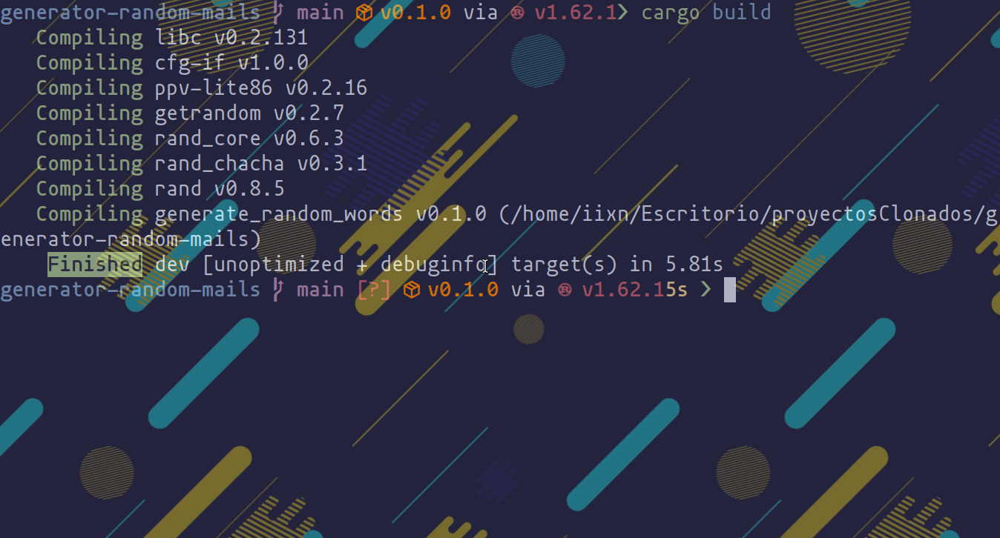
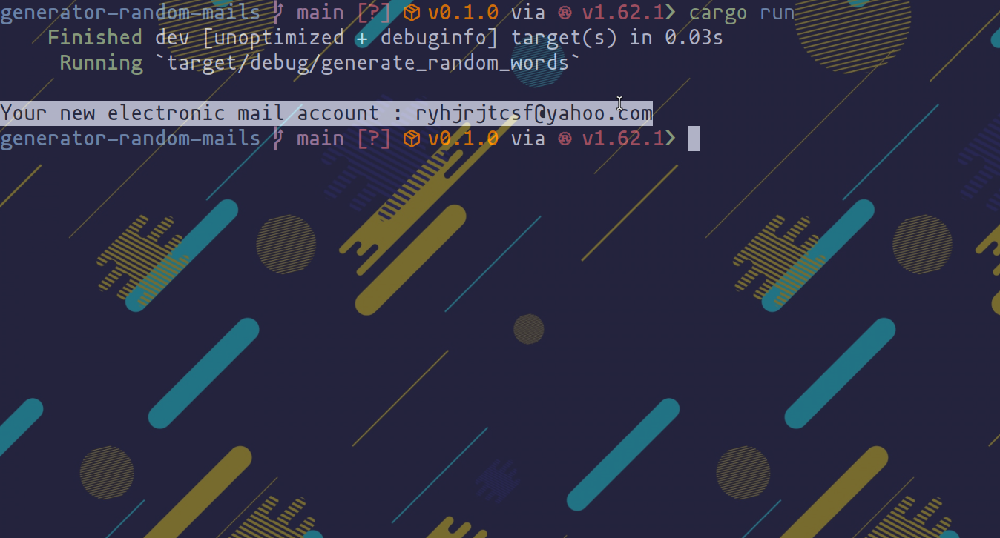

# generator-random-mails
Script that generates you a random mail account (written in rust)

First we will clonate the repository and move inside the repository:
```
git clone https://github.com/iixn/generator-random-mails.git
cd generator-random-mails
```
then we will build the program:
```
cargo build
```

One time the program is compiled we will run the program:
```
cargo run
```

And there we have our new electronic mail account :)

# IMPORTANT

The account is not checked if exists or not,you will have to look it
